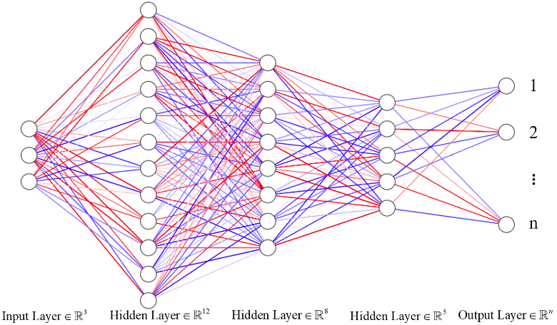

<h1 style="text-align: center; font-size: 35px; font-family: 'Sama Devanagari';"> Building Material Stock Estimation Method
</h1>

<h3 style="text-align: center; font-size: 28px; font-family: 'Sama Devanagari';"> 
Autonomous Building Material Stock Estimation Using 3D Modeling and Multilayer Perceptron: A Case of Hong Kong
</h3>

Qingxiang Li1, Benyun Zhao1, Xinyi Wang1, Guidong Yang1, Yuyang Chang2, Xi Chen1, and   <a href="http://www.mae.cuhk.edu.hk/~bmchen/">Ben M. Chen</a>1

1.Department of Mechanical and Automation Engineering, The Chinese University of Hong Kong     
2.Ecosystem Management, Department of Environmental System Sciences, ETH Zurich

 
<h2>Abstract</h2>

Building material stock (BMS) modeling is crucial to promote circular economy practices in urban environment. This study presents a fully autonomous bottom-up approach for BMS estimation using 3D Modeling and Multilayer Perceptron (MLP). 

 
<h2>MLP for Prediction</h2>

The MLP model is trained using the feature information collected from Building Information Modeling of local buildings. The model is trained using the following features, and method is demonstrated in the <a href="./building_predict.py" style="color: white; text-decoration: none;">python file</a>.

   

 
<h2>Acknowledgement</h2>

This work was supported by the InnoHK of the Government of the Hong Kong Special Administrative Region via the Hong Kong Centre for Logistics Robotics. 

